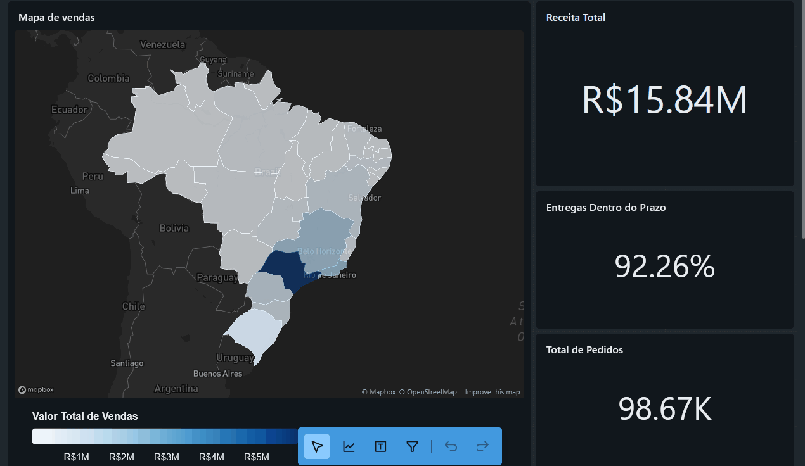
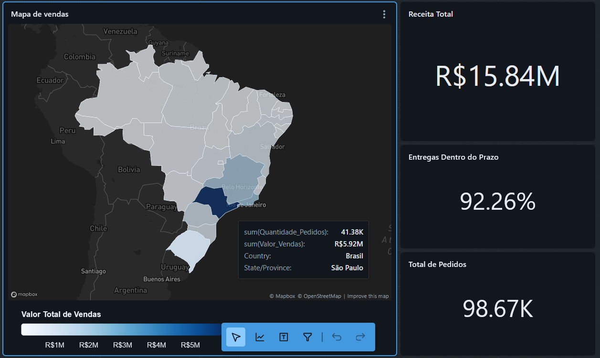
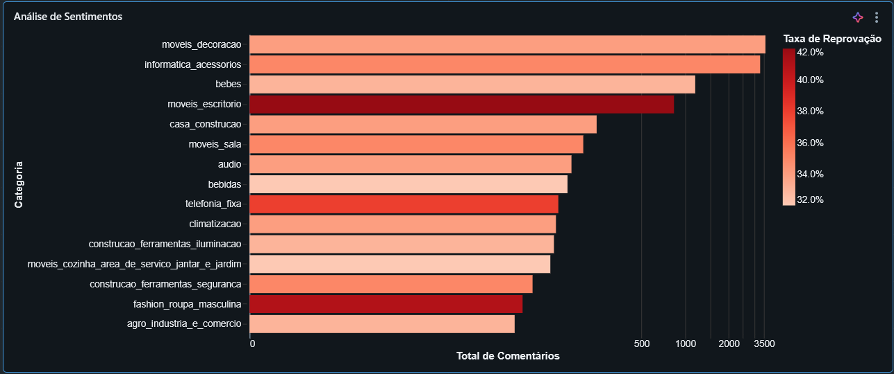

# Olist Lakehouse Project: Data Engineering & GenAI

Este projeto implementa uma solução completa de **Data Lakehouse** no **Databricks** utilizando a arquitetura **Medallion (Bronze, Silver, Gold)**. O objetivo é processar dados públicos de E-commerce da Olist, enriquecê-los com regras de negócio e aplicar **Inteligência Artificial Generativa (Google Gemini)** para análise qualitativa de avaliações de clientes e automação de alertas de risco.



## Visão Geral do Projeto

O projeto percorre todo o ciclo de vida dos dados, desde a ingestão até a ativação de insights com IA:

```mermaid
graph LR
    %% Definição de Estilos
    classDef external fill:#f9f9f9,stroke:#333,stroke-width:2px;
    classDef bronze fill:#cd7f32,stroke:#333,stroke-width:1px,color:white;
    classDef silver fill:#c0c0c0,stroke:#333,stroke-width:1px,color:black;
    classDef gold fill:#ffd700,stroke:#333,stroke-width:1px,color:black;
    classDef process fill:#e1f5fe,stroke:#0277bd,stroke-width:2px;

    subgraph External_Source [Fontes & APIs]
        Kaggle[Kaggle Dataset]:::external
        Gemini[Google Gemini API]:::external
        Discord[Discord Webhook]:::external
    end

    subgraph Databricks [Databricks Lakehouse]
        direction LR
        
        subgraph Bronze_Layer [Camada Bronze]
            Ingestao(01_ingestao):::process
            Volume[Volume: Raw CSVs]:::bronze
            BronzeTables[(Tabelas Bronze<br>Delta Lake)]:::bronze
            Loader(02_carga_bronze):::process
        end
        
        subgraph Silver_Layer [Camada Silver]
            Cleaner(03_camada_silver):::process
            SilverTables[(Tabelas Silver<br>Clean Data + NLP)]:::silver
        end
        
        subgraph Gold_Layer [Camada Gold]
            Modeler(04_camada_gold):::process
            GoldFact[(Fato Vendas)]:::gold
            GoldDim[(Dim Clientes RFM)]:::gold
            GoldReviews[(Reviews Analytics)]:::gold
            GoldAI[(AI Diagnostics)]:::gold
        end

        subgraph Activation [Ativação & Visualização]
            GenAI_Agent(05_analise_ia_generativa):::process
            Alert_System(06_automacao_alertas_ia):::process
            Dashboard[Dashboard Lakeview]:::process
        end
    end

    %% Fluxo de Ingestão
    Kaggle -->|Download Zip| Ingestao
    Ingestao --> Volume
    Volume -->|Leitura CSV| Loader
    Loader -->|Write Delta| BronzeTables

    %% Fluxo Silver
    BronzeTables -->|Leitura| Cleaner
    Cleaner -->|Deduplicação & Timestamp| SilverTables
    Cleaner -->|Análise de Sentimento| SilverTables

    %% Fluxo Gold
    SilverTables -->|Star Schema Join| Modeler
    Modeler --> GoldFact
    Modeler --> GoldDim
    Modeler --> GoldReviews

    %% Fluxo de IA e Ativação
    GoldReviews -->|Filtra Críticos| GenAI_Agent
    GenAI_Agent <-->|Prompt & Response| Gemini
    GenAI_Agent -->|Salva Insights| GoldAI
    
    GoldAI -->|Lê Diagnósticos| Alert_System
    Alert_System -->|Envia Alerta| Discord
    
    GoldFact --> Dashboard
    GoldDim --> Dashboard
    GoldReviews --> Dashboard
```

1. **Ingestão de Dados**: Coleta automatizada do dataset público da Olist (Kaggle).
2. **Arquitetura Medalhão**:
* **Bronze**: Dados brutos ingeridos e historizados.
* **Silver**: Limpeza, tipagem de dados e enriquecimento (incluindo NLP básica).
* **Gold**: Modelagem dimensional (Star Schema), cálculo de KPIs (RFM, Logística) e diagnósticos de IA.


3. **GenAI & Automação**: Uso do Google Gemini para ler comentários negativos, identificar dores dos clientes e sugerir ações, com sistema de alerta via Discord.
4. **Visualização**: Dashboard interativo para monitoramento logístico e de CX.

## Arquitetura e Fluxo de Dados

O pipeline é orquestrado através de uma série de Notebooks Databricks sequenciais:

### 1. Configuração e Ingestão

* **`00_criando_schemas.dbquery`**: Configuração do Catálogo Unity Catalog (`olist_portfolio`), schemas e volumes.
* **`01_ingestao`**: Conexão com a API do Kaggle para download e descompactação dos dados no Databricks Volume.
* **`02_carga_bronze`**: Leitura dos arquivos CSV brutos e gravação em tabelas Delta na camada **Bronze** (Append Only).

### 2. Tratamento e Refinamento

* **`03_camada_silver`**:
* Deduplicação e tratamento de schemas.
* Conversão de strings para Timestamp.
* **Feature Engineering**: Criação de labels de sentimento (Positivo/Neutro/Negativo) baseados nas notas das reviews.


* **`04_camada_gold`**:
* Criação da **Tabela Fato de Vendas** (joins entre pedidos, itens, produtos e vendedores).
* Criação da dimensão de clientes com segmentação **RFM** (Recência, Frequência, Monetário).
* Tabela analítica unificando reviews e dados de vendas.


### 3. Inteligência Artificial e Ação

* **`05_analise_ia_generativa`**:
* Identifica categorias de produtos com alta taxa de reprovação (>40%).
* Coleta os comentários negativos dessas categorias.
* Envia os textos para o **Google Gemini**, solicitando um resumo executivo das principais reclamações.
* Salva os diagnósticos na tabela `gold.ai_diagnostics`.


* **`06_automacao_alertas_ia`**:
* Lê os diagnósticos gerados pela IA.
* Simula (ou envia real) um alerta via **Webhook do Discord** para as áreas de negócio sobre categorias críticas.


## Dashboard (Lakeview)

O projeto inclui a definição de um Dashboard (`.lvdash.json`) focado em:

* **KPIs**: Receita Total, Total de Pedidos, Taxa de Entrega no Prazo.
* **Geográfico**: Mapa de vendas por estado.
* **CX**: Análise de sentimentos e taxa de reprovação por categoria.




## Tecnologias Utilizadas

* **Plataforma**: Databricks (Data Intelligence Platform)
* **Linguagens**: Python (PySpark), SQL
* **Armazenamento**: Delta Lake
* **IA Generativa**: Google Gemini API (`google-generativeai`)
* **Integrações**: Kaggle API, Discord Webhook
* **Bibliotecas**: `pyspark`, `pandas`, `databricks-sdk`, `requests`

## Como Executar

### Pré-requisitos

1. Workspace no Databricks configurado (Unity Catalog habilitado recomendado).
2. Conta no Kaggle (para gerar `kaggle.json` ou chaves de API).
3. API Key do Google Gemini (AI Studio).
4. (Opcional) URL de Webhook de um canal do Discord.

### Configuração de Ambiente

1. Clone este repositório no seu Databricks Workspace.
2. Instale as dependências listadas em `requirements.txt` (o notebook `01_ingestao` faz isso automaticamente).
3. Crie um arquivo `.env` na raiz do projeto (baseado no `.env.example`) ou configure os *Secrets* do Databricks com as seguintes chaves:
```env
KAGGLE_USERNAME=seu_usuario
KAGGLE_KEY=sua_chave
GEMINI_API_KEY=sua_api_key_gemini
DISCORD_WEBHOOK_URL=sua_url_webhook

```


### Execução

Execute os notebooks na seguinte ordem:

1. `00_criando_schemas.dbquery`
2. `01_ingestao`
3. `02_carga_bronze`
4. `03_camada_silver`
5. `04_camada_gold`
6. `05_analise_ia_generativa`
7. `06_automacao_alertas_ia`

## Licença

Este projeto está licenciado sob a licença MIT - veja o arquivo [LICENSE](https://www.google.com/search?q=LICENSE) para mais detalhes.

---

**Autor**: Rafael Adolfo
*Copyright © 2025*